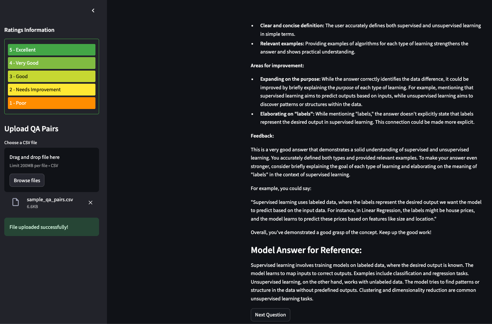

# In-Depth Question Answering Evaluation App

This Streamlit application allows users to evaluate their answers to a series of pre-defined questions using Gemini 1.5 Pro LLM. The app provides immediate feedback on the correctness and quality of the answers, helping users improve their understanding and accuracy.

## Acknowledgements

- Special thanks to Dr.Fady AlNajjar - Head of AI at UAE University for the idea of this application.
- This README file is generated using: https://huggingface.co/spaces/yasserrmd/ReadMeForge developed by Mohamed Yasser - Senior Solutions Architect at Sharjah Muncipality.

## Features

1. **Ratings Information:** A sidebar displays a rating scale from 1 (Poor) to 5 (Excellent), helping users understand the criteria for evaluating their answers.
2. **CSV File Upload:** Users can upload a CSV file containing questions and answers. The file should have at least two columns: question and answer.
3. **Randomized Questions**: Each session starts with a randomly selected question from a predefined list.
4. **User Input**: Users can input their answers using a text area.
5. **Real-time Feedback**: As the user types, the app provides real-time feedback on the answer, highlighting strengths and areas for improvement.
6. **Model Answer Reference**: After submitting an answer, the app displays the correct model answer for reference.
7. **Next Question Button**: Users can move to the next question at any time.

## Installation

To run this application locally, you need to have Python installed on your machine. Follow these steps:

1. Clone the repository or download the code.
2. Create a conda environment and activate it:
   ```bash
   conda create -n ques_ans_eval python=3.12
   conda activate ques_ans_eval
   ```
3. Install the required dependencies:
   ```bash
   pip install -r requirements.txt
   ```

### Running the App

To start the app, navigate to the directory containing the code and run:

```bash
streamlit run app.py
```

Open your web browser and go to `http://localhost:8501` to access the app.

## Usage

1. **Upload a CSV File**:

   - Go to the sidebar and click on "Upload QA Pairs".
   - Select a CSV file with columns `question` and `answer`.
   - Click "Choose a CSV file" to upload the file.

2. **Answer Questions**:
   - Once the file is uploaded, a random question will be displayed.
   - Enter your answer in the text area below the question.
   - Click "Submit and Evaluate" to receive feedback on your answer.
   - Optionally, click "Next Question" to proceed to another question.

View of the app




## Contributing

Contributions are welcome! Feel free to fork the repository and submit pull requests. For major changes, please open an issue first to discuss what you would like to change.

## Conclusion

The In-Depth Question Answering Evaluation App is a powerful tool for improving users' understanding and accuracy in answering questions. It combines real-time feedback with a randomized question set to provide a comprehensive learning experience. Whether you're a student, teacher, or anyone looking to enhance their NLP skills, this app is a valuable resource.

**Note:** This README file is generated using: https://huggingface.co/spaces/yasserrmd/ReadMeForge.

Feel free to reach out if you have any questions or need further assistance!
